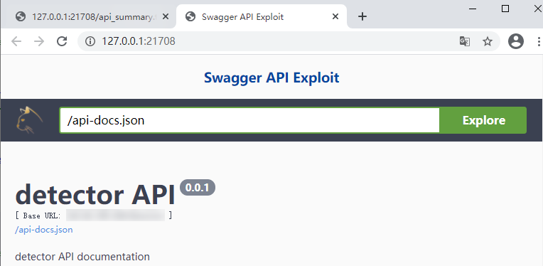
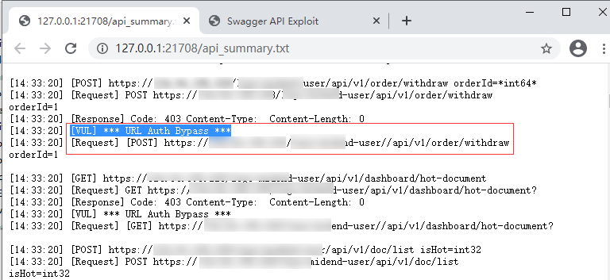

# **Swagger API Exploit 1.1**

这是一个 Swagger REST API 信息泄露利用工具。 主要功能有：

* 遍历所有API接口，自动填充参数
* 尝试 GET / POST 所有接口，返回 Response Code / Content-Type / Content-Length ，用于分析接口是否可以未授权访问利用
* 分析接口是否存在敏感参数，例如url参数，容易引入外网的SSRF漏洞
* 检测 API认证绕过漏洞
* 在本地监听一个Web Server，打开Swagger UI界面，供分析接口使用
* 使用Chrome打开本地Web服务器，并禁用CORS，解决部分API接口无法跨域请求的问题
* 当工具检测到HTTP认证绕过漏洞时，本地服务器拦截API文档，修改path，以便直接在Swagger UI中进行测试

## ChangeLog
* [2022-08-08] Fix chromeSwagger permission error
* [2021-04-04] 支持 Python3 

## 扫描器改进建议

* 分析json文档，将发现的URL，自动添加到爬虫中

## Usage

需要介入分析 api_summary.txt 文件中的内容

* 扫描所有API集，打开Swagger UI

  > python swagger-exp.py http://site.com/swagger-resources/

* 扫描一个API集，打开Swagger UI

  > python swagger-exp.py http://site.com/v2/api-docs

* 只打开Swagger UI，不扫描接口

  > python swagger-exp.py

## 工具截图

